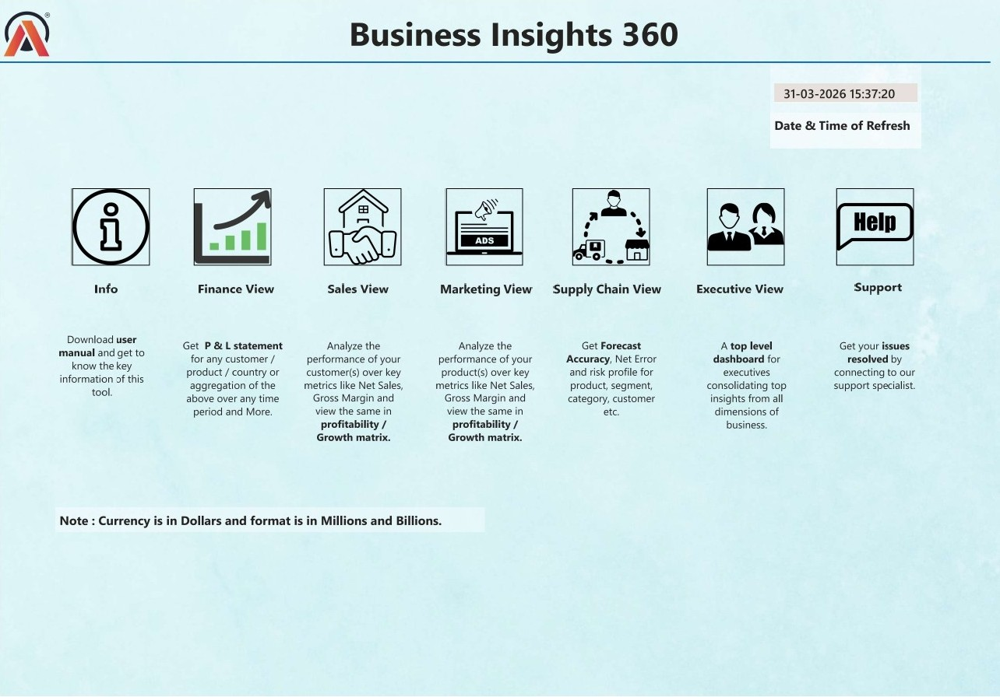
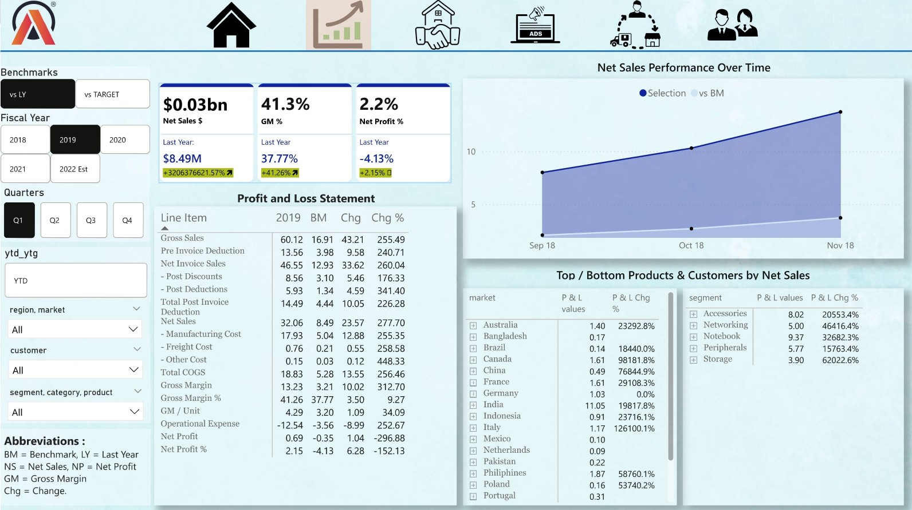
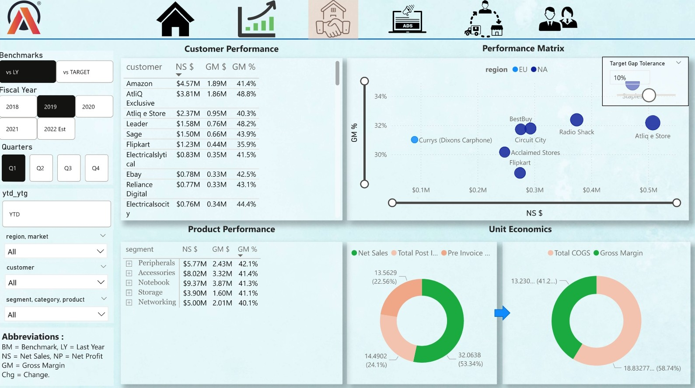
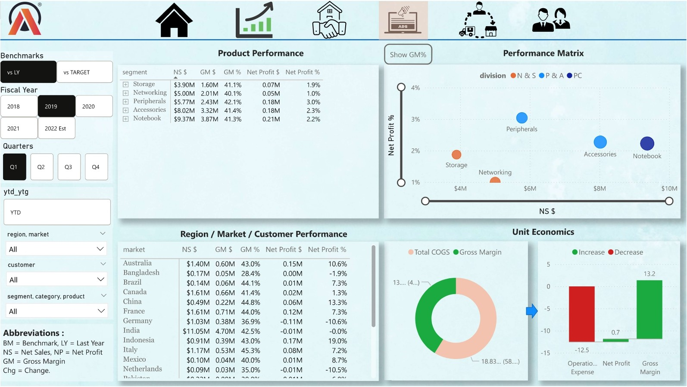
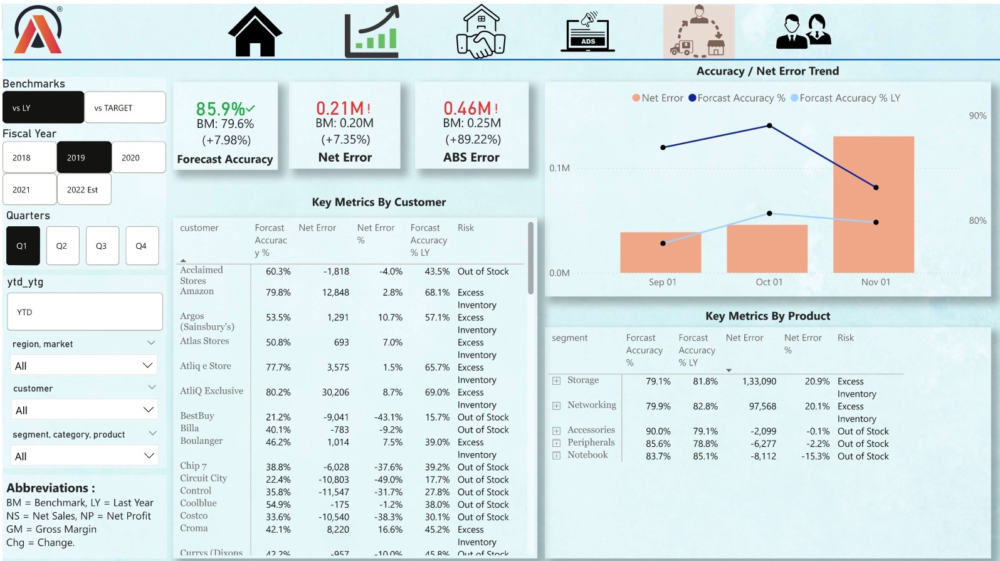
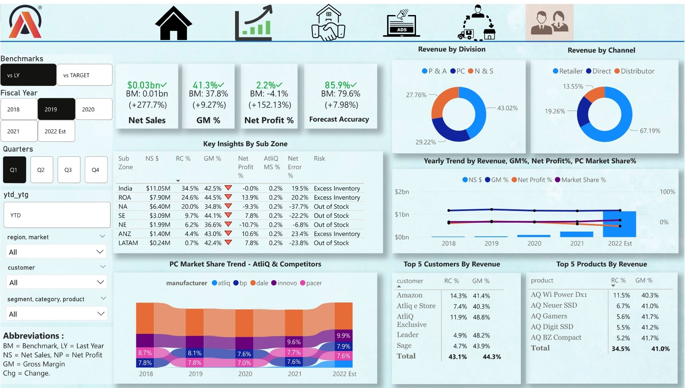

# 📊 Business Insights 360 — Multi-Functional Power BI Dashboard

> A comprehensive Business Intelligence solution built for AtliQ Hardware to replace Excel-based reporting with an interactive, centralized, and scalable analytics platform.

🔗 [View Live Dashboard](https://app.powerbi.com/view?r=eyJrIjoiOGQwOWUwZTYtMzdjZC00ZWFhLTk1Y2UtNDRlOTMyZjFhNTk0IiwidCI6ImM2ZTU0OWIzLTVmNDUtNDAzMi1hYWU5LWQ0MjQ0ZGM1YjJjNCJ9&pageName=a1eacd1be00de3fa391a)
---

## 📌 Problem Statement

**AtliQ Hardware** is a fast-growing consumer electronics company operating across multiple countries. Despite its rapid expansion, the company continued relying heavily on **Excel files** for analytics and reporting — a system that quickly became inefficient at scale.

This created serious business challenges:
- Reports were difficult to consume and interpret
- Insights were not generated quickly enough for decision-making
- Cross-functional performance lacked centralized visibility
- Leadership could not effectively monitor key KPIs
- The absence of strong analytics contributed to a **major business loss in Latin America**

To address this, senior executives invested in a full-scale **Business Intelligence initiative** — this dashboard is that solution.

---

## 🎯 Project Objective

Build a comprehensive Power BI dashboard that transforms raw business data into meaningful insights, enabling decision-makers to monitor performance across the entire organization.

The dashboard was designed to:
- Replace static Excel reporting with an **interactive BI solution**
- Create a **single source of truth** for business performance
- Track KPIs across **Finance, Sales, Marketing, Supply Chain & Executive** functions
- Help leadership identify risks, opportunities, and performance gaps proactively

---

## 🖥️ Dashboard Views

### 🏠 Home Page
A central navigation hub for smooth access to all dashboard sections.

---

### 💰 Finance View
Focuses on financial metrics such as profitability, margins, and overall financial health.

---

### 📈 Sales View
Analyzes sales performance across customers, products, markets, and regions.

---

### 📣 Marketing View
Evaluates business performance from a market and customer growth perspective.

---

### 🔗 Supply Chain View
Tracks forecast accuracy, operational efficiency, and supply chain performance.

---

### 👔 Executive View
Provides a high-level summary of overall business performance for senior leadership.

---

## 📊 Key KPIs Tracked

| KPI | Description |
|---|---|
| Net Sales (NS) | Total revenue from sales |
| Gross Margin (GM) | Revenue minus cost of goods sold |
| Gross Margin % | GM as a percentage of Net Sales |
| Net Profit & Net Profit % | Bottom-line profitability |
| Market Share % | Company's share in the market |
| P&L Performance | Overall Profit & Loss tracking |
| Forecast Accuracy % | How closely supply matches demand |
| Net Error & ABS Error | Forecasting deviation metrics |

---

## ✨ Features

- Interactive and user-friendly multi-page dashboard
- Dynamic KPI cards and summary metrics
- Drill-down analysis across multiple dimensions
- Time-based trend and comparative analysis
- Department-wise performance monitoring
- Executive-ready storytelling and visual insights

---

## 🛠️ Tools & Technologies

- **Power BI** — Dashboard development and visualization
- **DAX** — KPI calculations and custom measures
- **Power Query** — Data cleaning and transformation
- **SQL** — Backend data handling and preparation
- **Excel / CSV** — Source data

---

## 🧠 Skills Demonstrated

- Business Intelligence Reporting
- Data Modeling & Relationships
- Dashboard Design & UX
- DAX Calculations
- KPI Tracking & Performance Analysis
- Cross-Functional Business Analytics
- Decision Support Reporting

---

## 💼 Business Value

- Centralized view of company-wide performance
- Track profitability and revenue drivers across regions
- Monitor operational efficiency in the supply chain
- Identify underperforming areas before they escalate
- Move from **reactive reporting** to **proactive, data-driven decision-making**

---

## 📄 License

This project is for educational and portfolio purposes. The dataset is sourced from the [Codebasics Resume Project Challenge](https://codebasics.io/).
